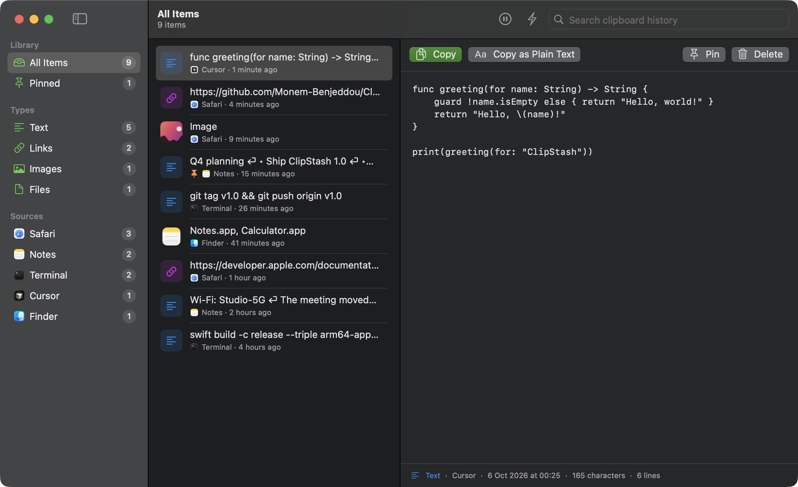
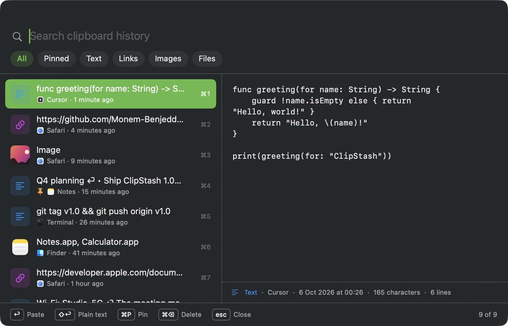

# ClipStash

[](https://github.com/Monem-Benjeddou/ClipStash/actions/workflows/build.yml)
[](https://github.com/Monem-Benjeddou/ClipStash/releases/latest)
[](LICENSE)


A clipboard history app for macOS. Search everything you've copied and paste it again from anywhere with one shortcut. It's free, open source, and keeps everything on your Mac.



| Quick Paste (⇧⌘V) | |
|---|---|
|  | Opens over any app. Type to search, use ↑↓ to choose an item, and press ↩ to paste it where you were working. |

## Features

- **Quick Paste (⇧⌘V).** A Spotlight-style panel opens over any app.
  - Type to search, then press ↩ to paste or ⇧↩ to paste as plain text.
  - ⌘1–⌘9 pastes one of the first nine items.
  - ⌘P pins an item and ⌘⌫ deletes it.
- **Library window.** Browse by type (Text, Links, Images, Files), by pinned items, or by the app you copied from. Each item has a full preview.
- **Keeps what you copy.** Plain and formatted text, links, images, and files, each with the app it came from. Copying the same thing again moves it to the top instead of creating a duplicate.
- **Pinned items** are never removed automatically.
- **Privacy.**
  - Anything an app marks as concealed (passwords from password managers, per the [nspasteboard.org](http://nspasteboard.org) markers) is never saved.
  - You can ignore specific apps entirely. Common password managers are ignored by default.
  - You can pause capturing at any time.
  - Nothing leaves your Mac.
- **Settings.**
  - history size (100 items up to unlimited)
  - the Quick Paste shortcut
  - launch at login
  - showing the app in the Dock
  - auto-paste

## Install

**Quickest:** paste this into Terminal. It downloads the latest release, checks its checksum and signature, and installs it into Applications without the "unidentified developer" warning ([read the script first](install.sh)):

```sh
curl -fsSL https://raw.githubusercontent.com/Monem-Benjeddou/ClipStash/main/install.sh | bash
```

Run the same command again later to update.

**Or install it yourself:**

1. Download `ClipStash-mac.zip` from the [latest release](https://github.com/Monem-Benjeddou/ClipStash/releases/latest) and unzip it.
2. Move `ClipStash.app` to `/Applications`.
3. Open it. ClipStash isn't notarized by Apple (that requires a paid developer account), so macOS blocks the first launch:
   - **macOS 15 or later:** close the warning, open **System Settings › Privacy & Security**, scroll down, and click **Open Anyway** next to ClipStash.
   - **macOS 14:** right-click ClipStash.app, choose **Open**, then click **Open** again.
   - **Or**, in Terminal: `xattr -dr com.apple.quarantine /Applications/ClipStash.app`
4. Optional: to have ClipStash paste into the active app for you, grant **Accessibility** access in **Settings › General**. Without it, choosing an item copies it and you press ⌘V yourself.

## Where your data lives

Your history is stored in `~/Library/Application Support/ClipStash/`:

- `history.json` holds the index and text.
- `images/` holds copied images as PNG files.

To delete everything, quit ClipStash and remove that folder.

## Reliability

- **Your history is never wiped by a bad file.** If `history.json` can't be read, it's renamed to `history-unreadable-<date>.json` and kept. ClipStash starts a new history and tells you what happened.
- **Saves are crash-safe.** Each write replaces the file in a single step. Writes happen one at a time, so an older save can't overwrite a newer one, and the latest state is saved when you quit.
- **Save failures are shown.** If the disk is full or the folder isn't writable, a banner says so instead of failing silently.
- **Your clipboard is safe on failure.** If an image's file is missing, or none of a copied file list exists anymore, ClipStash reports it and leaves your current clipboard untouched. If only some files are missing, the remaining ones are copied and you get a warning.
- **Shortcut conflicts are shown.** If another app already uses the shortcut, ClipStash says so in the window and in Settings, and you can pick another one.
- **Large images don't freeze the app.** They're converted and fingerprinted on a background queue. Items over the size limits (5 MB of text, 25 MB per image) are skipped.
- **Logging.** Errors are logged to the unified log:
  ```sh
  log stream --predicate 'subsystem == "dev.clipstash.ClipStash"'
  ```

## Build from source

You need the Swift 5.10+ toolchain (Xcode or the Command Line Tools).

```sh
git clone https://github.com/Monem-Benjeddou/ClipStash.git
cd ClipStash
./build.sh            # → build/ClipStash.app (universal: arm64 + x86_64)
./build.sh 1.2.0      # same, with the version number set
```

`build.sh` signs with `$SIGN_IDENTITY` if set. Otherwise it uses a local certificate named "… Local Signing" from your keychain, or falls back to ad-hoc signing. A stable certificate means the Accessibility permission isn't lost after each rebuild.

### Project layout

| File | Purpose |
|------|---------|
| `HistoryStore.swift` | Watches the clipboard, de-duplicates, and saves history |
| `QuickPanel.swift` | The ⇧⌘V panel, which takes keyboard focus without pulling focus away from the app you're in |
| `LibraryView.swift` | Main window: sidebar, list, and preview |
| `Components.swift` | Shared rows, thumbnails, previews, and icon caches |
| `Settings.swift` | Preferences and the Settings window |
| `HotKey.swift` | Global shortcut (Carbon) and the auto-paste keystroke |

## Releasing

[`build.yml`](.github/workflows/build.yml) builds and verifies the universal app on every push and pull request. When you push a version tag, it also publishes a GitHub Release with `ClipStash-mac.zip` and its SHA-256 checksum:

```sh
git tag v1.1 && git push origin v1.1
```

To sign releases with your own certificate (for example, a Developer ID), add these repository secrets:

- `MAC_CERT_P12`: the base64-encoded `.p12`
- `MAC_CERT_PASSWORD`: its password

Without them, the build is signed ad hoc and the workflow shows a warning.

## License

[MIT](LICENSE) © Monem Benjeddou
